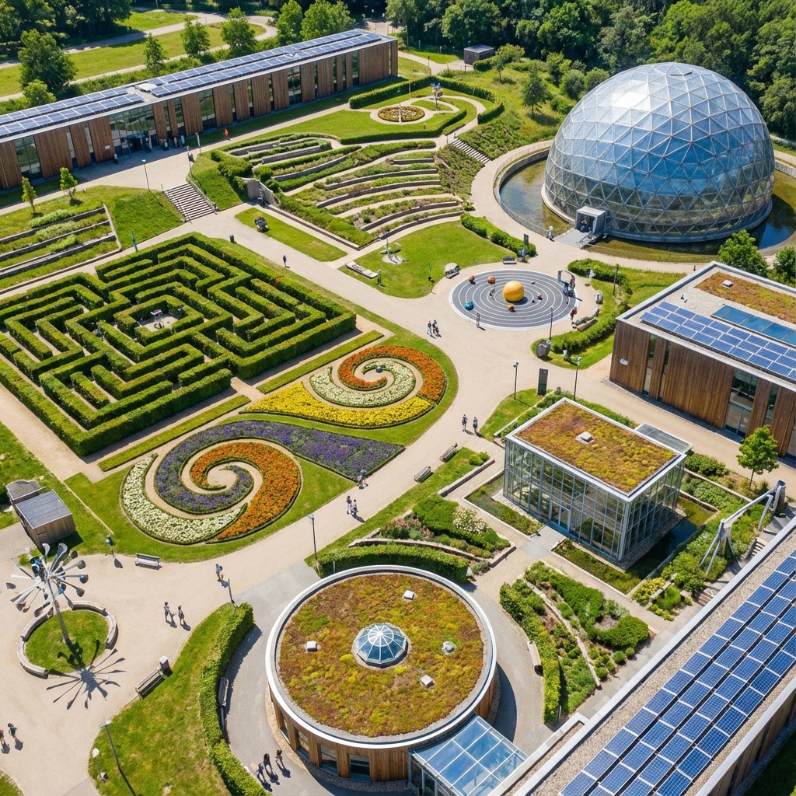

<div align="center">

  

  # 🧪 Science Park Dhamtari
  ### The Official Educational Tourism Portal
  
  [](https://scienceparkdhamtari.com/)
  [](https://dhamtari.gov.in/)
  [](https://nextjs.org/)
  
  <p align="center">
    <b>Explore • Learn • Innovate</b><br/>
    <i>A flagship initiative by the District Administration of Dhamtari, Chhattisgarh.</i>
  </p>

</div>

---

## 🌟 About The Project

Welcome to the **Official Digital Portal of Science Park Dhamtari**. Nestled near the scenic Gangrel Dam, this park is a modern temple of knowledge designed to ignite scientific curiosity in young minds and provide a serene learning environment for all.

This platform bridges the gap between the physical park and the digital world, offering real-time updates, virtual galleries, and essential visitor information.

### 🏛️ Official Recognition
This project acts as the central information hub for the Science Park, recognized and supported by the local **Municipal Corporation** and **District Administration**.

---

## ✨ Features at a Glance

| Feature | Description |
| :--- | :--- |
| **📰 News & Updates** | Stay informed with the latest inaugurations, events, and press releases provided in real-time. |
| **📸 Virtual Gallery** | Experience high-definition visuals of our Indoor & Outdoor exhibits before you visit. |
| **📱 Mobile First** | A fully responsive progressive web app (PWA) experience tailored for seamless mobile access. |
| **🗺️ Smart Navigation** | Integrated Google Maps with one-click directions to guide visitors directly to the park. |
| **🤳 Social Feed** | Live social media wall featuring our latest activities, reels, and community interactions. |
| **♿ Accessibility** | Designed with inclusivity in mind, adhering to modern web accessibility standards. |

---

## �️ Visual Tour

<div align="center">
  
</div>

> *Experience the perfect blend of nature and technology.*

---

## 🛠️ Technology Stack

We utilize cutting-edge technologies to ensure speed, security, and scalability.

-   **Frontend**: [Next.js 16](https://nextjs.org/) (App Router), [React](https://reactjs.org/), [TypeScript](https://www.typescriptlang.org/)
-   **Styling**: [Tailwind CSS](https://tailwindcss.com/), [Aceternity UI](https://ui.aceternity.com/)
-   **Animation**: [Framer Motion](https://www.framer.com/motion/), [Lottie](https://lottiefiles.com/)
-   **Forms**: [React Hook Form](https://react-hook-form.com/), [Zod](https://zod.dev/), [EmailJS](https://www.emailjs.com/)
-   **Deployment**: [Vercel](https://vercel.com/) (Global Edge Network)

---

## � Getting Started locally

To contribute or run this project on your local machine:

1.  **Clone the Repository**
    ```bash
    git clone https://github.com/kafilcodes/science-park.git
    cd science-park
    ```

2.  **Install Dependencies**
    ```bash
    npm install
    ```

3.  **Run Development Server**
    ```bash
    npm run dev
    ```

4.  **Access the App**
    Open [http://localhost:3000](http://localhost:3000) in your browser.

---

## 📍 Visitor Information

-   **Location**: [Rudri Road, Near Gangrel Dam, Dhamtari, Chhattisgarh](https://goo.gl/maps/YourMapLink)
-   **Timings**: 10:00 AM - 06:00 PM (Daily)
-   **Entry Fee**: ₹10 only

---

## 🤝 Contact Official

For official inquiries, collaborations, or school visits:

-   **District Administration**: [dhamtari.gov.in](https://dhamtari.gov.in)
-   **Email**: info@scienceparkdhamtari.com
-   **Emergency Contact**: check our [Contact Page](https://scienceparkdhamtari.com/#contact)

---

<div align="center">

  **Science Park Dhamtari** © 2025  
  *An Education & Tourism Initiative*

  [](https://scienceparkdhamtari.com)

</div>
